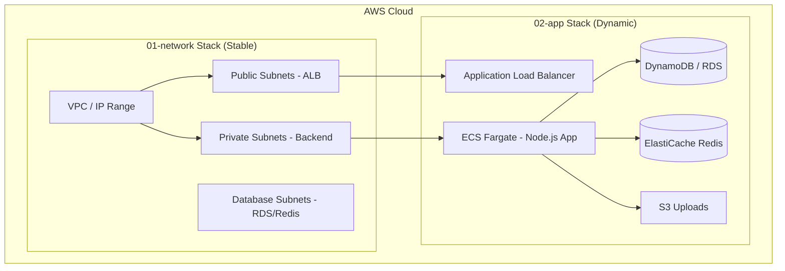

# 🏗️ Hướng Dẫn Kiến Trúc Terraform (Kicks-Shoes)

> **Phạm vi:** Tài liệu này mô tả chi tiết kiến trúc hạ tầng dưới dạng mã (IaC), cách phân tách các thành phần (Stacks), quản lý trạng thái (State) và quy trình vận hành chuyên nghiệp cho dự án Kicks-Shoes.

---

## 📌 Mục Lục
1. [Tổng Quan Về Terraform](#-tổng-quan-về-terraform)
2. [Tại Sao Phải Chia Stack?](#-tại-sao-phải-chia-stack)
3. [Cấu Trúc Thư Mục Chuẩn](#-cấu-trúc-thư-mục-chuẩn)
4. [Mô Hình Quản Lý State (Remote Backend)](#-mô-hình-quản-lý-state-remote-backend)
5. [Luồng Vận Hành (Workflow)](#-luồng-vận-hành-workflow)
6. [Sử Dụng Modules Từ Registry](#-sử-dụng-modules-từ-registry)
7. [Tích Hợp CI/CD](#-tích-hợp-cicd)

---

## 🚀 Tổng Quan Về Terraform

Terraform là công cụ **Infrastructure as Code (IaC)** cho phép chúng ta định nghĩa hạ tầng AWS bằng ngôn ngữ HCL (HashiCorp Configuration Language). Thay vì thao tác thủ công trên AWS Console, mọi thay đổi đều được thực hiện qua mã nguồn, giúp đảm bảo tính nhất quán và dễ dàng khôi phục.

### Lợi ích cốt lõi:
- **Version Control:** Mọi thay đổi hạ tầng đều có lịch sử trên Git.
- **Reproducibility:** Dễ dàng nhân bản môi trường Dev sang Prod trong vài phút.
- **Team Collaboration:** Hỗ trợ nhiều người cùng làm việc mà không xung đột nhờ cơ chế Lock State.

---

## 🧩 Tại Sao Phải Chia Stack?

Dự án được chia làm 2 lớp (Stack) độc lập để tối ưu hóa việc quản lý:

### 1. `01-network` (Lớp Nền Tảng)
- **Thành phần:** VPC, Subnets, NAT Gateway, Internet Gateway, Route Tables.
- **Đặc điểm:** Rất ít khi thay đổi, cực kỳ ổn định.
- **Lợi ích:** Được triển khai một lần và dùng chung cho toàn bộ ứng dụng phía trên.

### 2. `02-app` (Lớp Ứng Dụng)
- **Thành phần:** ALB, ECS (Fargate), RDS, DynamoDB, S3, ElastiCache, Secrets Manager.
- **Đặc điểm:** Thay đổi thường xuyên theo yêu cầu tính năng hoặc deploy code backend.
- **Lợi ích:** Có thể cập nhật hoặc phá hủy lớp App mà không ảnh hưởng đến hệ thống mạng cơ sở.



---

## 📁 Cấu Trúc Thư Mục Chuẩn

Hệ thống được tổ chức theo mô hình **Module-First Architecture**:

```text
infrastructure/
├── modules/                # Các thành phần tái sử dụng (Custom Modules)
│   ├── network/            # Logic VPC/Subnet
│   ├── ecs/                # Logic Cluster/Service
│   └── database/           # Logic RDS/DynamoDB
├── environments/           # Cấu hình cụ thể cho từng môi trường
│   ├── dev/                # Môi trường Development
│   │   ├── 01-network/     # Khởi tạo mạng cho Dev
│   │   └── 02-app/         # Khởi tạo App cho Dev
│   └── prod/               # Môi trường Production (Sẽ nhân bản từ Dev)
└── scripts/                # Các script tiện ích (Check, Deploy, Clean)
```

---

## 💾 Mô Hình Quản Lý State (Remote Backend)

Chúng ta tuyệt đối không lưu file `terraform.tfstate` ở máy cá nhân. Thay vào đó, State được quản lý tập trung:

> [!IMPORTANT]
> **S3 Bucket:** Lưu trữ file trạng thái (State) an toàn, có bật Versioning để rollback khi cần.
> **DynamoDB Table:** Thực hiện **Locking**. Khi một người đang `apply`, người khác sẽ bị chặn để tránh ghi đè làm hỏng hạ tầng.

### Cấu hình Backend mẫu:
```hcl
terraform {
  backend "s3" {
    bucket         = "kicks-shoes-tf-state"
    key            = "dev/02-app/terraform.tfstate"
    region         = "ap-southeast-1"
    dynamodb_table = "terraform-locks"
    encrypt        = true
  }
}
```

---

## 🔄 Luồng Vận Hành (Workflow)

Quy trình chuẩn từ máy Local đến AWS:

1. **Local Dev:** Viết code `.tf` -> Chạy `./scripts/check.sh` để kiểm tra format.
2. **Terraform Plan:** Xem trước các thay đổi.
   ```bash
   terraform plan -var-file="terraform.tfvars"
   ```
3. **Pull Request (PR):** Đẩy code lên GitHub, Team Lead review output của `plan`.
4. **Auto-Deploy:** Sau khi Merge vào branch chính, CI/CD tự động chạy `apply`.

> [!TIP]
> Luôn sử dụng lệnh `terraform fmt -recursive` trước khi commit để code luôn sạch đẹp và dễ đọc.

---

## 📦 Sử Dụng Modules Từ Registry

Dự án ưu tiên sử dụng các module chính chủ từ **Terraform Registry** để đảm bảo bảo mật và hiệu năng:

| Module | Nguồn (Source) | Mục đích |
| :--- | :--- | :--- |
| **VPC** | `terraform-aws-modules/vpc/aws` | Xây dựng mạng chuẩn AWS |
| **ALB** | `terraform-aws-modules/alb/aws` | Cân bằng tải chuyên nghiệp |
| **ECS** | `terraform-aws-modules/ecs/aws` | Quản lý Container Fargate |
| **Security Group** | `terraform-aws-modules/security-group/aws` | Quản lý tường lửa lớp app |

---

## 🤖 Tích Hợp CI/CD

Toàn bộ quy trình triển khai được tự động hóa qua GitHub Actions:
- **Khi tạo PR:** Tự động chạy `terraform validate` và `terraform plan`. Kết quả plan được comment trực tiếp vào PR.
- **Khi Merge:** Tự động `terraform apply` để cập nhật hạ tầng thật.

> [!CAUTION]
> Tuyệt đối không bao giờ commit file `terraform.tfvars` chứa thông tin nhạy cảm (Password, Secret Key) lên GitHub. Hãy sử dụng file `.example` để hướng dẫn người dùng khác.

---
*Tài liệu này được biên soạn cho dự án Kicks-Shoes. Mọi thắc mắc vui lòng liên hệ DevOps Team.*
