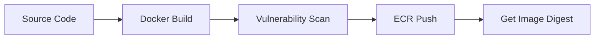

# ⚙️ Hướng Dẫn Vận Hành Backend & Hạ Tầng ECS

> **Phạm vi:** Tài liệu này dành cho Backend Developers và DevOps Engineers để hiểu cách triển khai, quản lý và giám sát ứng dụng Node.js chạy trên nền tảng AWS ECS Fargate.

---

## 📌 Nội dung chính
1. [Vị Trí Backend Trong Kiến Trúc](#-vị-trí-backend-trong-kiến-trúc)
2. [Quy Trình Triển Khai (Deployment Flow)](#-quy-trình-triển-khai-deployment-flow)
3. [Cấu Hình Runtime & Environment Variables](#-cấu-hình-runtime--environment-variables)
4. [Giám Sát & Xử Lý Sự Cố](#-giám-sát--xử-lý-sự-cố)
5. [Quy Tắc Rollback](#-quy-tắc-rollback)

---

## 🏗️ Vị Trí Backend Trong Kiến Trúc

Ứng dụng Backend của chúng ta không chạy trên Server truyền thống (EC2) mà chạy trên **ECS Fargate (Serverless Container)**.

### Luồng Traffic:
1. **User** truy cập qua Domain.
2. **ALB (Application Load Balancer)** nhận request và kiểm tra tính hợp lệ.
3. **Target Group** điều hướng traffic vào các **ECS Tasks** đang ở trạng thái `Healthy`.
4. **Backend App** xử lý logic và truy xuất dữ liệu từ:
   - **DynamoDB/RDS:** Dữ liệu chính.
   - **ElastiCache Redis:** Cache & Session.
   - **S3:** Lưu trữ file/ảnh.
   - **Secrets Manager:** Lấy các API Keys nhạy cảm.

---

## 🚢 Quy Trình Triển Khai (Deployment Flow)

Chúng ta tuân thủ quy trình triển khai 3 bước để đảm bảo an toàn tuyệt đối:

### Bước 1: Kiểm tra trước khi Deploy (Pre-deploy Audit)
Trước khi build image, hãy chạy script kiểm tra lỗi logic:
```powershell
./scripts/predeploy-backend-audit.ps1
```
> [!NOTE]
> Script này sẽ kiểm tra: Biến môi trường thiếu, lỗi cú pháp, kết nối DB local, và port cấu hình.

### Bước 2: Build & Push Image
Sử dụng Docker để đóng gói ứng dụng và đẩy lên **AWS ECR (Elastic Container Registry)**.


### Bước 3: Cập nhật hạ tầng bằng Terraform
Sau khi có Image mới trên ECR, chúng ta cập nhật **Task Definition** trong Terraform:
```bash
terraform apply -var="container_image=<ECR_IMAGE_URI>"
```

---

## 🔐 Cấu Hình Runtime & Environment Variables

Toàn bộ cấu hình nhạy cảm được quản lý bởi **AWS Secrets Manager**, không bao giờ để trong code.

| Biến (Variable) | Nguồn (Source) | Mục đích |
| :--- | :--- | :--- |
| `PORT` | Terraform Env | Cổng ứng dụng (Mặc định 3000) |
| `MONGODB_URI` | Secrets Manager | Kết nối cơ sở dữ liệu |
| `JWT_SECRET` | Secrets Manager | Mã hóa token bảo mật |
| `AWS_REGION` | Terraform Env | Khu vực triển khai hạ tầng |
| `DATABASE_PROVIDER` | Terraform Env | Chọn `mongodb` hoặc `dynamodb` |

> [!IMPORTANT]
> **Health Check:** Ứng dụng BẮT BUỘC phải có endpoint `GET /api/health` trả về HTTP 200. Nếu endpoint này lỗi, ALB sẽ coi Container đã chết và tự động tiêu diệt nó.

---

## 🔍 Giám Sát & Xử Lý Sự Cố

| Triệu chứng | Nguyên nhân tiềm tàng | Cách kiểm tra |
| :--- | :--- | :--- |
| **ALB 502/504** | App bị crash hoặc khởi động quá chậm | Xem `CloudWatch Logs` |
| **Target Unhealthy** | Sai Port hoặc sai Health Check Path | Kiểm tra `outputs.tf` của module ALB |
| **Access Denied** | Thiếu quyền IAM cho Task Role | Kiểm tra `iam.tf` trong module app |
| **State Locked** | Có người đang apply dở thì bị ngắt mạng | Chạy `terraform force-unlock <ID>` |

---

## 🛠️ Quy Tắc Rollback

Khi bản deploy mới gây lỗi nghiêm trọng, hãy thực hiện rollback theo thứ tự:

1. **Khẩn cấp (ECS Side):** Update ECS Service về Task Definition version cũ nhất đang chạy ổn định. (Mất < 1 phút).
2. **Triệt để (Terraform Side):** Revert code trên Git và chạy lại pipeline deploy để đồng bộ hạ tầng.

---
> [!TIP]
> Luôn xem log thời gian thực bằng lệnh: `aws logs tail /ecs/kicks-shoes-dev --follow`

*Tài liệu này được duy trì bởi dự án Kicks-Shoes.*
