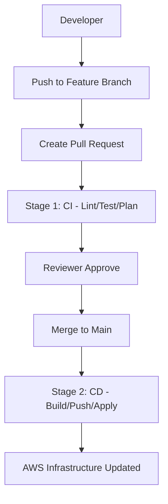

# 🤖 Tự Động Hóa Với GitHub Actions CI/CD

> **Mục tiêu:** Tài liệu này hướng dẫn cách thiết lập và vận hành luồng triển khai tự động (CI/CD) cho dự án Kicks-Shoes bằng GitHub Actions, đảm bảo mọi thay đổi hạ tầng và mã nguồn đều được kiểm tra kỹ lưỡng trước khi lên môi trường thật.

---

## 📌 Nội Dung Chính
1. [Luồng Triển Khai Tổng Quan](#-luồng-triển-khai-tổng-quan)
2. [Cấu Hình GitHub Secrets](#-cấu-hình-github-secrets)
3. [Chi Tiết Các Stages Trong Pipeline](#-chi-tiết-các-stages-trong-pipeline)
4. [Tự Động Hóa Backend (Build & Push ECR)](#-tự-động-hóa-backend-build--push-ecr)
5. [Tự Động Hóa Hạ Tầng (Terraform Plan/Apply)](#-tự-động-hóa-hạ-tầng-terraform-planapply)

---

## 🏗️ Luồng Triển Khai Tổng Quan

Quy trình được thiết kế theo mô hình **GitOps**, nơi Git là "Source of Truth" duy nhất:



---

## 🔐 Cấu Hình GitHub Secrets

Để GitHub Actions có thể tương tác với AWS, bạn cần cấu hình các Secrets sau trong mục **Settings > Secrets and variables > Actions**:

| Secret Name | Mô Tả |
| :--- | :--- |
| `AWS_ACCESS_KEY_ID` | Access Key của IAM User chuyên dụng cho CI/CD |
| `AWS_SECRET_ACCESS_KEY` | Secret Key tương ứng |
| `AWS_REGION` | Ví dụ: `ap-southeast-1` |
| `ECR_REPOSITORY` | Tên ECR Repository để push image |
| `APP_CONFIG_SECRET` | Nội dung cấu hình app (nếu cần inject trực tiếp) |

---

## 🚀 Chi Tiết Các Stages Trong Pipeline

### 🛡️ Stage 1: Continuous Integration (CI)
*Chạy khi có Pull Request.*
- **Lints:** Kiểm tra định dạng code Backend (ESLint) và Terraform (`terraform fmt`).
- **Tests:** Chạy Unit Tests cho Backend.
- **Terraform Plan:** Tạo file kế hoạch thay đổi hạ tầng và comment trực tiếp vào PR để Reviewer có thể xem nhanh.

### 🚢 Stage 2: Continuous Deployment (CD)
*Chạy khi code được Merge vào branch `main` hoặc `production`.*
- **Build Backend:** Đóng gói code thành Docker Image với Tag là Git SHA.
- **Push ECR:** Đẩy Image lên AWS ECR.
- **Terraform Apply:** Cập nhật hạ tầng với Image URI mới nhất.
- **ECS Rollout:** Force Deployment để ECS thay thế các Container cũ bằng Container mới.

---

## 🐳 Tự Động Hóa Backend (Build & Push ECR)

Pipeline sử dụng `aws-actions/amazon-ecr-login` để đăng nhập an toàn vào ECR:

```yaml
- name: Build and Push to ECR
  env:
    ECR_REGISTRY: ${{ steps.login-ecr.outputs.registry }}
    IMAGE_TAG: ${{ github.sha }}
  run: |
    docker build -t $ECR_REGISTRY/$ECR_REPOSITORY:$IMAGE_TAG ./backend
    docker push $ECR_REGISTRY/$ECR_REPOSITORY:$IMAGE_TAG
    echo "image=$ECR_REGISTRY/$ECR_REPOSITORY:$IMAGE_TAG" >> $GITHUB_OUTPUT
```

---

## 🛠️ Tự Động Hóa Hạ Tầng (Terraform)

Chúng ta sử dụng `hashicorp/setup-terraform` để cài đặt Terraform CLI trên GitHub Runner:

> [!IMPORTANT]
> **State Locking:** Pipeline sẽ tự động sử dụng DynamoDB để lock state. Nếu có 2 pipeline chạy cùng lúc, cái thứ 2 sẽ phải chờ cái thứ nhất hoàn thành để tránh xung đột hạ tầng.

### Workflow Implementation:
File: `.github/workflows/terraform-pipeline.yml`

```yaml
name: "🚀 Infrastructure Pipeline"

on:
  push:
    branches: [main]
    paths: ['infrastructure/**']
  pull_request:
    branches: [main]
    paths: ['infrastructure/**']

jobs:
  terraform:
    runs-on: ubuntu-latest
    steps:
      - uses: actions/checkout@v4
      - uses: hashicorp/setup-terraform@v3
      
      - name: Terraform Init
        run: terraform init
        working-directory: infrastructure/environments/dev
        
      - name: Terraform Plan
        if: github.event_name == 'pull_request'
        run: terraform plan -no-color
        working-directory: infrastructure/environments/dev
        
      - name: Terraform Apply
        if: github.ref == 'refs/heads/main' && github.event_name == 'push'
        run: terraform apply -auto-approve
        working-directory: infrastructure/environments/dev
```

---

## 📈 Giám Sát Sau Triển Khai

Sau khi pipeline hoàn tất, bạn có thể kiểm tra trạng thái qua:
1. **GitHub Actions Tab:** Xem log chi tiết của từng bước.
2. **CloudWatch Logs:** Theo dõi log khởi động của Container mới.
3. **SNS Notifications:** (Nếu cấu hình) Nhận thông báo qua Email/Slack khi Deploy thành công hoặc thất bại.

---
> [!TIP]
> Luôn sử dụng `auto-approve` một cách cẩn trọng. Chỉ nên bật cho các môi trường Non-Prod hoặc khi bạn đã tin tưởng tuyệt đối vào kết quả của `terraform plan`.

*Tài liệu hỗ trợ dự án Kicks-Shoes - DevOps Team.*
